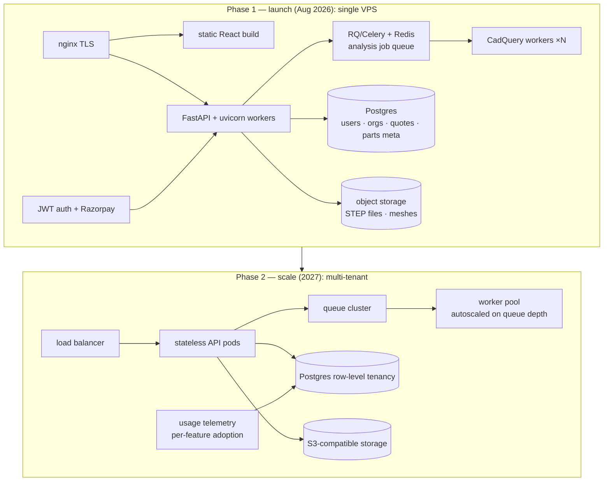

# CNC Plan & Process Pro — Technical Architecture & 2-Year Vision

**Version:** 1.0 · **Date:** 2026-07-08 · **Branch:** `v4-web-ui` · **Audience:** engineers / CTO-level review
**Status of claims:** everything in §1–§3 is shipped and gated on `v4-web-ui` today; §5 is forward-looking.

---

## 1. System architecture (current, as shipped)

```mermaid
flowchart LR
    subgraph Client["Frontend — React 19 + Vite + TypeScript"]
        UI[App.tsx workspace<br/>Overview · Strategy · Estimate · Route]
        R3F[react-three-fiber viewer<br/>part mesh · exact-face highlights<br/>workholding scene · setup cameras]
        LS[(localStorage<br/>cnc.* operator prefs<br/>custom machines/materials)]
        UI <--> R3F
        UI <--> LS
    end

    subgraph API["Engine API — FastAPI (uvicorn :8000)"]
        AN["/api/analyze<br/>dims · candidates · DFM · MSA<br/>setups · stock · mesh · turning"]
        ST["/api/strategy<br/>setup-grouped ops · tools · times<br/>hole_stats · workholding · geometry"]
        WM["/api/weldment<br/>BOM groups · per-part features<br/>assembly ops · times"]
        LIB["/api/tools · /api/machines<br/>/api/materials · /api/sample"]
    end

    subgraph Engine["Detection & Planning Engine (Python + CadQuery/OCCT)"]
        SP[step_parser.py<br/>face records · 48-frame classifier<br/>axisymmetric detection 19-1<br/>OD/ID turning re-type 19-2/19-3<br/>undercut flags 19-5]
        CLS[slot_hole_classifier.py<br/>exact cylinder geometry<br/>holes: L/D · through/blind · tip cone<br/>slots: entry/opening dirs<br/>fillet/chamfer counts]
        OP[operation_planner.py<br/>milling op templates<br/>wall/floor finish split<br/>deep-hole bore branch]
        TP[turning_planner.py<br/>lathe insert library<br/>OD/ID/groove templates<br/>Vc·feed/rev cycle times · 19-6 tailstock]
        TE[time_estimator.py<br/>cut/rapid/toolchange/setup<br/>reconciled totals]
        WH[workholding.py · dfm_score.py<br/>body_scope.py · quote_export.py]
        WELD[weldment/*<br/>body_splitter · part_grouper<br/>process_planner · time_estimator]
    end

    subgraph Data["Data libraries (JSON, versioned in git)"]
        TOOLS[(46 milling tools<br/>+ 6 lathe inserts)]
        MACH[(36 machines<br/>18 India/ME curated)]
        MATS[(9 materials<br/>+ operator customs)]
    end

    subgraph Gates["Test-gate system (run before every commit)"]
        G1[detection regression 30/30]
        G2[VMC handover smoke 6/6]
        G3[hole-split EXACT vs competitor]
        G4[estimate integrity]
        G5[tsc + vite build]
    end

    Legacy[Streamlit app.py<br/>v3 branch — engine parity<br/>fallback + operator validation]

    Client -- multipart STEP + params --> API
    API --> Engine
    Engine --> Data
    Engine -.gated by.-> Gates
    Legacy --> Engine
```

### Request flow (the one that matters)

`STEP upload → parse_step_auto (OCCT via CadQuery) → face records → 48-frame classification (axis permutations, best machining frame wins) → candidates → [axisymmetric? → OD/ID turning re-type + groove split + end-face flags] → planners (milling rules + turning templates) → per-op cycle times → setup grouping + workholding → estimate ledger / routed quote`.

Body-scoped requests re-run classification per solid with the **exact cylinder classifier** (validated path) instead of billet heuristics.

## 2. Honest current-state assessment

### Validated (gated, competitor-checked)
| Capability | Evidence |
|---|---|
| Feature detection, prismatic + turned | **30/30 regression suite** (was 22/30 before the lathe epic; every file passes incl. 8 turned-part fixtures and 2 trap cases) |
| Hole recognition accuracy | **Exact per-diameter match** with Toolpath.com on the reference weldment plate (22/22: 7×Ø5, 4×Ø9.8, 8×cbore Ø11/Ø18, 2×Ø20, 1×Ø25) |
| Cycle-time realism | Plate: ours 33–38 min vs Toolpath 42 (≈90% agreement); rail: ours 23 vs 21 min (≈90%) |
| Machinable-surface % | Validated per-body surface walk: 99.9% with published exclusions vs Toolpath's 99.x% (previously a misleading 42.8% from billet heuristics) |
| Estimate math | Integrity regression: duplicate ops neutral, reference features neutral, displayed components reconcile to totals |
| Multibody weldments | Body split → grouped BOM → per-part validated features → assembly (weld/fit/inspect) phases with times |

### v1 / heuristic (working, honestly labeled in-product)
- **Thread inference** — tap-drill table (Ø4.2→M5 …), *likely*-tap labels; no thread detection from CAD (STEP carries none).
- **Turning planning** — insert-level templates + surface-speed cycle times; no lathe G-code, no canned-cycle simulation.
- **Setup/workholding** — rule-based recommendations (vise/chuck/fixture from stock geometry); not force-verified.
- **Undercut/thread-zone flags** — geometric heuristics that raise *verify* notes, deliberately not silent decisions.

### Missing (known, scheduled — see §5)
- Auth / users / multi-tenancy; any database (all state is per-request + browser localStorage)
- Job queue (analysis is a ~90 s synchronous request with a spinner)
- Payments (Razorpay planned), deployment hardening, telemetry
- CAM toolpath generation & simulation — **deliberately out of scope** (see §5.5)

## 3. Engineering principles that got us here (keep them)

1. **Validated geometry beats clever heuristics.** Every accuracy jump came from exact OCCT geometry (cylinder axes, cone semi-angles, face areas) replacing bbox guesses.
2. **Hard gates before every commit.** Machining-logic changes additionally require explicit owner sign-off before push.
3. **Honest v1s.** A heuristic ships with a *verify* flag and a tooltip explaining its basis, never disguised as detection.
4. **Module boundaries per machine type.** `turning_planner.py` shares nothing with the milling planner — a lathe bug cannot regress VMC quoting.
5. **The operator owns the numbers.** Presets, complexity, tolerance class, rates: estimation knobs are visible multipliers, not hidden tuning.

## 4. Test-gate inventory

| Gate | What it protects | Pass bar |
|---|---|---|
| `run_feature_detection_regression.py` | 30 STEP fixtures, per-type expected counts incl. trap cases | 30/30 |
| `run_vmc_handover_smoke.py` | End-to-end plan on 6 representative parts | 6/6 |
| `run_hole_split_validation.py` | Per-diameter hole table vs competitor ground truth | EXACT |
| `run_estimate_integrity_regression.py` | Estimate idempotency + component reconciliation | PASS |
| `tsc -b && vite build` | Frontend types + production bundle | clean |

## 5. Two-year technical vision

### 5.1 Deployment: VPS → multi-tenant SaaS (Q3 2026 → Q2 2027)

- **Job queue is the first launch blocker to fix:** analysis becomes `POST → job id → poll/websocket`, workers scale independently of the API. CadQuery workers are process-isolated (OCCT crashes must not take the API down — we already know its failure modes).
- **Tenancy model:** org → users → parts/quotes; quotes are the revenue object (retention + repeat-quote analytics).

### 5.2 AI tier (paid differentiator, Week-2 epic onward)
- **Grounded assistant, not a chatbot:** the model receives the *validated* plan JSON (features, ops, times, exclusions) and answers "why is this 38 minutes?", "what if I use a 12 mm endmill?", "draft a customer email for this quote."
- **Never in the geometry loop:** detection/planning stays deterministic and gated; AI explains, drafts, and suggests operator-reviewable overrides. This is both a safety stance and a cost stance (no GPU in the quote path).
- **Second phase:** RFQ-inbox parsing (drawing + email → pre-filled quote draft) — highest willingness-to-pay workflow in the segment.

### 5.3 Libraries at scale (the data moat)
- Schema-versioned JSON → Postgres tables with provenance per row (`manufacturer_catalog | distributor | operator | curated`).
- **Operator flywheel:** every "+ Add machine/material/tool" is a signed contribution; curation pipeline promotes popular entries to the shared library (opt-in, anonymized).
- Targets: 500+ machines (every Ace/BFW/Jyoti/LMW/HMT/Macpower model in Indian clusters), 1,000+ tools (MTAB/Mitsubishi/Kennametal/YG-1/Taegutec metric catalogs), 50+ materials incl. Indian standard grades (IS 2062, IS 65032, EN-8/24, SG iron grades).
- Feeds/speeds provenance ladder: catalog default → cluster-observed medians (telemetry) → shop-specific learned values.

### 5.4 Machine-type roadmap (engine modules)
| When | Module | Approach |
|---|---|---|
| Now | VMC milling | shipped, validated |
| Now | Lathe turning | detection + planning v1 shipped (Epics 19/20); G-code + canned cycles next |
| +2 qtrs | Turn-mill | cross-hole/flat detection on shafts (TM01 fixture exists), C-axis setup model |
| +2 qtrs | Drilling/tapping centers | subset of VMC planner + tapping cycles + thread inference graduation |
| +3 qtrs | Sheet metal: laser + bend | new detection family (unfold, bend lines); reuses estimate/route/quote stack unchanged |
| +4 qtrs | Wire EDM | profile extraction from through-contours; slow-feed cost model |
| Later | 5-axis (3+2 first) | flagged beta; reachability analysis, not toolpaths |
| Later | Grinding | cycle-time models only (no path planning) |
| 2027+ | 3D printing / molding / casting | same detect→plan→estimate→route pattern; molding = part cost + mold amortization model |

### 5.5 The CAM boundary (deliberate non-goal)
We **plan and price** machining; we do not generate or simulate toolpaths. Toolpath.com licenses ModuleWorks for that — a kernel representing decades of work. Our quote → their (or any) CAM via clean handoff exports (setup sheets, op lists, STEP pass-through). If customer pull demands integrated CAM in 2027+, the decision is **license (ModuleWorks/hSpeed) vs partner**, never build.

### 5.6 Engineering guardrails for the 2-year horizon
- The 5-gate system travels into CI (GitHub Actions) with the synthetic fixture set force-added; customer STEP files never enter the repo.
- Detection changes always land behind per-file expectation contracts with notes (`T09` trap-case pattern).
- Per-cluster golden parts: each new machine-type module ships with its own fixture family (T-series pattern) before UI work starts.
